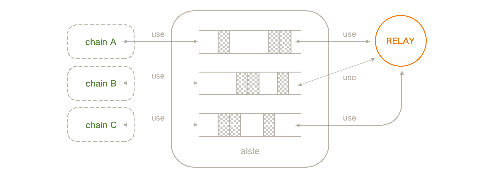

# Codex.Relay
Relay Blockchain based `Codex.IO`

- [Codex.Relay](#codexrelay)
  - [Introduction](#introduction)
  - [More Information](#more-information)

## Introduction

`Codex.Relay` is chain in Codex muit-chain system, 
it provides high performance relay service to other chains.

In Codex, chains and chains can share their state to each other, 
but it is difficult for a chain to connect to all other chains,
We need a relay chain to be a relay for each chains, so there is `Codex.Relay`.

## More Information

[Main Page](http://www.codex.network/#/en)
